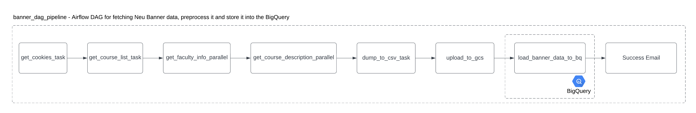
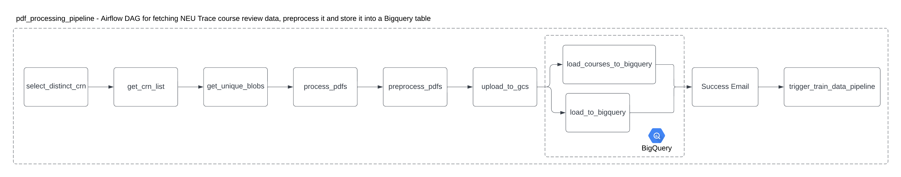
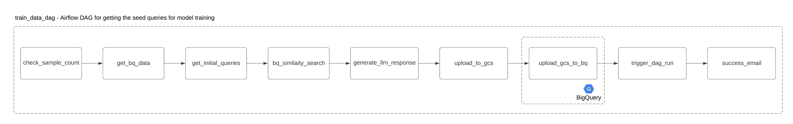

# Course Registration Chatbot

## Overview

This project aims to develop an LLM-powered chatbot to streamline and simplify the course registration process for college students. The chatbot will integrate data from multiple sources, including Banner and Trace, to provide personalised course recommendations, verify program requirements, check prerequisites, and offer insights on professor reviews. The system will be built using Google Cloud
Platform (GCP) and will incorporate MLOps best practices, including monitoring and CI/CD pipelines, to ensure robust and efficient operation.

This repository hosts the data pipeline designed to collect, process, and store data related to Northeastern University course offerings and student feedback.


## Data Pipeline - Key Components and Workflow

### 1. Data Collection
The pipeline collects three main types of data:
- **Course Information**: Web scraping scripts fetch details about course offerings from the NEU Banner system, including CRN, title, instructor, etc.
- **Student Feedback**: Extracts student feedback from NEU Trace instructor comments reports, which are available as PDF documents and uploaded to Google Cloud Storage (GCS) for processing.
- **Training Data**: Uses specific seed queries and refined data from BigQuery to generate structured data for training purposes.

### 2. Data Processing
The collected data undergoes several stages of processing:
- **PDF Data Extraction**: Python-based scripts analyze the PDF files to extract relevant course evaluation comments.
- **Data Cleaning**: Removes irrelevant details and standardizes the data to ensure consistency across different sources.
- **Structured Data Creation**: Organizes the cleaned data into structured datasets optimized for analysis.

### 3. Train Data Generation
Using the `train_data_dag` in Airflow, the pipeline generates seed data for training a model. This process involves:
- **Data Retrieval**: Fetches initial data from BigQuery and performs similarity searches to refine the dataset.
- **LLM Response Generation**: Generates responses from a language model (LLM) based on the seed queries and processed data.
- **Data Upload**: The generated data is uploaded to GCS and then loaded back into BigQuery to be used as training data.

This automated DAG enables systematic preparation of data needed for training and ensures consistency in the generation process.

### 4. Data Storage
The processed data is stored for easy access and analysis:
- **Google Cloud Storage (GCS)**: Intermediate results, final datasets, and training data are stored in designated GCS buckets.
- **BigQuery**: Structured datasets and training data are ingested into BigQuery tables for efficient querying and analysis.

## Airflow DAGs Overview

### 1. **Banner Data DAG Pipeline** (`banner_dag_pipeline`)
This Airflow DAG focuses on fetching data from the NEU Banner system, processing it, and storing it in BigQuery. The steps are as follows:




- **get_cookies_task**: Retrieves authentication cookies to access Banner data.
- **get_course_list_task**: Obtains a list of courses from the Banner system.
- **get_faculty_info_parallel**: Collects faculty information for each course, running tasks in parallel.
- **get_course_description_parallel**: Fetches course descriptions in parallel for efficiency.
- **dump_to_csv_task**: Converts the data into a CSV format for easier handling and debugging.
- **upload_to_gcs**: Uploads the CSV file to Google Cloud Storage.
- **load_banner_data_to_bq**: Loads the Banner data from GCS into BigQuery.
- **Success Email**: Sends an email notification upon successful data loading.


This pipeline streamlines the process of gathering and storing course and faculty information from the Banner system. 

### 2. **PDF Processing Pipeline** (`pdf_processing_pipeline`)
This Airflow DAG is set up to process NEU Trace course review data. It fetches data, processes it, and then stores it in a BigQuery table. Here’s how it works:



- **select_distinct_crn**: Selects unique Course Registration Numbers (CRNs) to identify distinct courses.
- **get_crn_list**: Fetches a list of CRNs to be processed.
- **get_unique_blobs**: Retrieves unique PDF files from the data source.
- **process_pdfs**: Extracts data from each PDF.
- **preprocess_pdfs**: Prepares the extracted data for storage by cleaning and structuring it.
- **upload_to_gcs**: Uploads the preprocessed data to Google Cloud Storage.
- **load_courses_to_bigquery** and **load_to_bigquery**: Loads processed course and review data into specific BigQuery tables.
- **Success Email**: Notifies the team upon successful completion of the data processing.
- **trigger_train_data_pipeline**: Triggers the training data pipeline once PDF processing is complete.


This pipeline is essential for organizing and storing course review data in a structured format for analysis.


### 3. **Train Data DAG** (`train_data_dag`)



This Airflow Directed Acyclic Graph (DAG) is responsible for generating seed queries to train a model. It involves several steps:

- **check_sample_count**: Ensures that there are enough samples available for training.
- **get_bq_data**: Retrieves data from BigQuery to be used for training.
- **get_initial_queries**: Generates initial queries based on the data retrieved.
- **bq_similarity_search**: Uses BigQuery to perform similarity searches, which help in refining the data for training.
- **generate_llm_response**: Generates responses from a language model based on the seed data.
- **upload_to_gcs**: Uploads processed data to Google Cloud Storage.
- **upload_gcs_to_bq**: Loads the data from Google Cloud Storage back into BigQuery.
- **trigger_dag_run**: Triggers additional DAG runs if necessary.
- **success_email**: Sends an email notification upon successful completion of the pipeline.


This DAG is designed to automate the preparation and processing of training data in a systematic way.

These DAGs automate and organize different stages of the data pipeline, each targeting a specific dataset (training data, course reviews, or Banner data) for Northeastern University courses.

## Model Pipeline - Key Components and Workflow

### 1. Loading Data from the Data Pipeline for Model Training

**Overview**: Automates data extraction, cleaning, and preparation for training using **Apache Airflow**, **Google BigQuery**, and **Google Cloud Storage (GCS)**.

**Key Features**:
- **End-to-End Automation**: Detects new data in BigQuery and triggers data preparation without manual intervention.
- **Real-Time Updates**: Ensures training is based on the latest data for relevance and accuracy.
- **Cloud Integration**: Scalable querying with BigQuery and efficient storage with GCS.

**Workflow**:
1. **Data Retrieval**:
   - Airflow DAG queries BigQuery using pre-defined SQL.
   - Fetches fields like `query`, `context`, and `response` from relevant tables.
   - Ensures data integrity by validating schema compliance.
2. **Data Cleaning and Transformation**:
   - Removes null or invalid entries.
   - Handles missing data using imputation strategies if required.
   - Standardizes text fields for model readiness.
3. **Data Formatting**:
   - Converts data into **JSONL** for compatibility with fine-tuning workflows.
   - Ensures fields are aligned for supervised fine-tuning and evaluation (e.g., `instruction`, `context`, `expected response`).
4. **Storage and Accessibility**:
   - Processed data is versioned and stored locally.
   - Automatically uploads datasets to GCS with metadata (e.g., timestamp, batch ID).

**Triggering**:
- The DAG is triggered dynamically on new data detection in BigQuery, ensuring the pipeline is always aligned with the latest information.

### 2. Training and Selecting the Best Model

**Overview**: Automates fine-tuning of pre-trained models, integrating with Vertex AI and Airflow.

**Key Components**:
- **Fine-Tuning**:
  - Base model: `gemini-1.5-flash-002`.
  - Supervised fine-tuning (SFT) on task-specific data from GCS.
- **Metrics**:
  - Standard: BLEU, ROUGE (1, 2, L), groundedness, instruction following.
  - Custom: Bias detection and fairness metrics.
- **Version Control**:
  - Fine-tuned models are versioned in Vertex AI for easy rollback or performance tracking.

**Workflow**:
1. **Training Data Preparation**:
   - Formats and cleans data in JSONL.
   - Uploads datasets to GCS with metadata for traceability.
2. **Fine-Tuning**:
   - Initiates training on Vertex AI, leveraging pre-configured pipelines.
   - Records training hyperparameters, data versions, and logs for reproducibility.
3. **Evaluation and Selection**:
   - Evaluates performance using test datasets.
   - Models are ranked using a weighted scoring system that considers both standard and custom metrics.
   - Automatically selects the best-performing model for deployment.
4. **Bias Detection**:
   - Incorporates additional tests to measure bias, fairness, and inclusivity.
   - Generates a bias report detailing areas of improvement.
5. **Model Registry Update**:
   - Saves the selected model to Vertex AI's registry with associated metadata, evaluation results, and experiment details.

**Key Features**:
- Automates the entire training process from data preparation to model deployment.
- Ensures fairness with built-in bias detection.
- Supports model versioning for traceability and rollback.


### 3. Model Evaluation

**Overview**: Evaluates fine-tuned models using rigorous metrics to ensure quality and fairness.

**Key Components**:
- **Dataset**:
  - Test data prepared from the data pipeline.
  - Structured as `instruction`, `context`, and `expected response`.
- **Metrics**:
  - **Standard**:
    - BLEU: Measures textual similarity.
    - ROUGE: Measures n-gram overlap.
    - Exact Match: Percentage of fully correct responses.
  - **Custom**:
    - Relevance: Degree to which the response addresses the query.
    - Coverage: Completeness and depth of the response.
- **Bias Detection**:
  - Evaluates gender neutrality and inclusivity in responses.
  - Uses a 5-point rubric to score bias levels.

**Workflow**:
1. **Trigger Post-Training**:
   - DAG waits for training completion before starting evaluation.
   - Retrieves the trained model version from Vertex AI.
2. **Generate Predictions**:
   - Runs the model on the test dataset to generate predictions.
   - Uses structured prompts to ensure consistency in evaluation.
3. **Calculate Metrics**:
   - Computes standard and custom metrics for each response.
   - Aggregates results into a summary report.
4. **Bias Detection**:
   - Analyzes responses for neutrality and inclusivity.
   - Generates a detailed bias report with recommendations.
5. **Result Storage**:
   - Saves evaluation results locally and uploads to GCS for integration with dashboards.

**Key Features**:
- Dynamic selection of the latest trained model.
- Comprehensive evaluation combining standard and custom metrics.
- Scalable to handle large datasets and complex models.

### 4. Model Bias Detection

**Overview**: Ensures the model's responses are free from gender bias and uphold inclusivity.

**Bias Detection Criteria**:
- **Gender Bias Presence**: Detects tendencies toward specific gender preferences or stereotypes.
- **Neutrality**: Measures if responses avoid gendered language.
- **Inclusivity**: Ensures diverse and respectful representation.

**Implementation**:
1. **Query Generation**:
   - Creates diverse prompts to test responses for bias.
   - Examples include: "What is the teaching style of {prof_name}?" or "How approachable is {prof_name}?"
2. **Response Evaluation**:
   - Uses sentiment analysis and manual scoring.
   - Rates responses on a 5-point rubric (1 = strongly biased, 5 = completely neutral).
3. **Bias Report**:
   - Aggregates results into a detailed report.
   - Highlights patterns and areas for improvement.


### 5. Model Registry & Experiment Tracking

**Platform**: Vertex AI.

**Key Features**:
- **Model Registry**:
  - Stores models with metadata (training data, hyperparameters, metrics).
  - Supports version control and rollback.
- **Experiment Tracking**:
  - Logs hyperparameters, evaluation metrics, and artifacts.
  - Provides comparisons between experiments to identify the best-performing model.


### 6. CI/CD for Model Training

**Overview**: Implements automated Continuous Integration and Continuous Deployment.

**Workflow**:
1. **Triggering**:
   - Detects data updates in BigQuery and triggers the training DAG.
2. **End-to-End Integration**:
   - Links data preparation, training, evaluation, and deployment.
3. **Deployment**:
   - Deploys the best-performing model to Vertex AI endpoints.
4. **Error Handling**:
   - Alerts on task failures with detailed logs for debugging.


### 7. Notifications & Alerts

**Overview**: Keeps stakeholders informed with real-time updates.

**Integration**:
- **Trigger Points**:
  - Data preparation completion.
  - Model training completion.
  - Evaluation results.
  - Task failures.
- **Alerts**:
  - Sends detailed emails with links to logs and results.


## Project Directory Structure and Description

```
├── .github
│   └── workflows
│       ├── gcd-upload.yaml: Defines a CI/CD pipeline for uploading code to Google Cloud Storage.
│       ├── python-tests.yaml: Runs Python tests using pytest, triggered by specific branches.
│       └── trigger-banner-dag.yaml: Manages triggering the Banner data pipeline DAG in Airflow.
│
├── .gitignore: Specifies files and directories to ignore during Git operations.
│
├── README.md: Main documentation file explaining the project structure, usage, and contributions.
├── README.pdf: PDF version of the README.md for offline use.
│
├── assets
│   └── imgs
│       ├── Banner_Data_DAG.png: Visualization of the Banner Data DAG workflow.
│       ├── PDF_Processing_DAG.png: Diagram illustrating the PDF Processing DAG.
│       └── Train_Data_DAG.png: Diagram for the training data generation DAG.
│
├── data_pipeline
│   ├── __init__.py: Initializes the `data_pipeline` package.
│
│   ├── dags
│       ├── __init__.py: Initializes the `dags` package for Airflow workflows.
│       ├── banner_data_dag.py: Airflow DAG for fetching course data from the NEU Banner system.
│       ├── trace_data_dag.py: Airflow DAG for processing TRACE data, including extraction and loading into BigQuery.
│       ├── train_data_dag.py: Airflow DAG for generating synthetic training data using LLMs and BigQuery.
│       ├── scripts
│           ├── __init__.py: Initializes the `scripts` sub-package.
│           ├── backoff.py: Implements exponential backoff retry logic for error handling.
│           ├── banner
│               ├── __init__.py: Initializes the `banner` sub-package.
│               ├── fetch_banner_data.py: Functions for fetching course details from the NEU Banner system.
│               └── opt_fetch_banner_data.py: Optimized version with multithreading for faster data retrieval.
│           ├── bq
│               ├── __init__.py: Initializes the `bq` (BigQuery) utility package.
│               └── bigquery_utils.py: Utility functions for interacting with BigQuery.
│           ├── constants.py: Stores configuration constants for the project.
│           ├── data
│               ├── __init__.py: Initializes the `data` sub-package.
│               ├── data_anomalies.py: Functions for detecting and managing data anomalies.
│               ├── data_processing.py: Prepares data for generating initial LLM queries.
│               └── data_utils.py: Utility functions for data handling, cleaning, and parsing.
│           ├── email_triggers.py: Handles email notifications for pipeline events.
│           ├── gcs
│               ├── __init__.py: Initializes the `gcs` (Google Cloud Storage) package.
│               └── gcs_utils.py: Functions for managing GCS file storage and retrieval.
│           ├── llm_utils.py: Functions for interacting with LLMs, including prompt generation and response parsing.
│           ├── mlmd
│               ├── __init__.py: Initializes the `mlmd` (Machine Learning Metadata) package.
│               └── mlmd_preprocessing.py: Prepares metadata for ML model lineage tracking.
│           ├── seed_data.py: Stores seed data and templates for initializing LLM queries.
│           └── trace
│               ├── __init__.py: Initializes the `trace` sub-package.
│               └── extract_trace_data.py: Extracts and processes TRACE instructor comments.
│
│       ├── tests
│           ├── __init__.py: Initializes the `tests` package for unit testing.
│           ├── test_extract_trace_data.py: Unit tests for `extract_trace_data.py`.
│           └── test_fetch_banner_data.py: Unit tests for `fetch_banner_data.py`.
│
│   ├── logs
│       └── __init__.py: Placeholder for logging setup or future functionality.
│
│   └── variables.json: JSON file containing pipeline configurations and settings.
│
├── model_training
│   ├── __init__.py: Initializes the `model_training` package.
│
│   ├── dags
│       ├── __init__.py: Initializes the `dags` sub-package for Airflow workflows related to model training.
│       ├── model_evaluation_dag.py: Airflow DAG for evaluating trained models.
│       ├── train_model_trigger_tag.py: Airflow DAG for triggering model training workflows.
│       ├── model_scripts
│           ├── __init__.py: Initializes the `model_scripts` sub-package.
│           ├── config.py: Configuration file for model training parameters.
│           ├── create_bias_detection_data.py: Generates data for bias detection during training.
│           ├── custom_eval.py: Contains custom evaluation metrics for models.
│           ├── data_utils.py: Utility functions for preparing and handling training datasets.
│           ├── model_eval.py: Functions for running and reporting model evaluations.
│           ├── model_evaluation.py: Main script for model evaluation logic.
│           ├── prepare_dataset.py: Prepares datasets for training and evaluation.
│           └── prompts.py: Stores prompts for generating synthetic data using LLMs.
│
├── requirements.txt: Lists Python dependencies for the project.
```

## Instruction to Reproduce
To reproduce this data pipeline on Google Cloud Platform (GCP), follow these instructions:

### Prerequisites

1. **Google Cloud Account**: Make sure you have an active Google Cloud account.
2. **Project Setup**: Create a new GCP project or use an existing one. Note down the `PROJECT_ID`.
3. **Billing Enabled**: Ensure billing is enabled for your project.
4. **Google Cloud SDK**: Install the [Google Cloud SDK](https://cloud.google.com/sdk/docs/install) to interact with GCP resources.
5. **Python 3.x**: Make sure Python 3.10 is installed.

### Step 1: Set Up GCP Services and Resources

#### 1.1. Enable Required APIs

Go to GCP Console - 
1. BigQuery - Enable API
2. Cloud Composer - Enable API
3. VertexAI - Enable API


#### 1.2. Set Up Cloud Storage Buckets

1. Create a Cloud Storage bucket to store data and pipeline artifacts. Replace `BUCKET_NAME` and `PROJECT_ID` with your values.

   ```bash
   export BUCKET_NAME=<your-bucket-name>
   gcloud storage buckets create gs://$BUCKET_NAME --project $PROJECT_ID --location=<region>
   ```
   Make sure the region is coherent with the composer region, or select multi-region bucket.

2. Create folders inside the bucket for organizing data and other artefacts:

   ```bash
   gsutil mkdir gs://$BUCKET_NAME/data
   ```

#### 1.3. Set Up BigQuery Dataset

1. Create a BigQuery dataset to store processed data.

   ```bash
   export DATASET_NAME=<your-dataset-name>
   bq --location=<region> mk --dataset $PROJECT_ID:$DATASET_NAME
   ```

### Step 2: Configure Airflow with Cloud Composer

1. **Create a Cloud Composer Environment**:
   - Go to the **Cloud Composer** page in the GCP Console.
   - Create a new Composer environment, specify Python 3 as the runtime, and select the same region as the other resources.
   - Note the `Composer Environment Name` and `GCS Bucket` associated with Composer for later steps.

2. **Upload DAGs and Scripts**:
   - Update the github workflows to match your GCP environment (Project, Bucket, etc). The workflow will take care of uploading the files to the bucket.

4. **Update Environment Variables** in Composer to reference the GCS bucket, BigQuery dataset, and other configurations. These can be set in the Airflow `Variables` section within the Composer UI.
   - You can use the environment file provided to setup the composer environment. Go to the Composer -> Airflow UI -> Admin -> Variables -> Import Variables
   - Upload the file.

6. **Python Package Dependencies**:
   - Update the `requirements.txt` file with the necessary dependencies.
   - Install the dependencies in Composer by specifying the path to `requirements.txt` in the Composer environment configuration.

### Step 3: CI/CD Pipeline Setup with GitHub Actions

1. **GitHub Actions Workflow**:
   - The `gcd-upload.yaml` file should handle uploading code to GCS on pushes to specific branches.
   - The `python-tests.yaml` file should handle unit tests and linting.

### Step 4: Testing the Pipeline

1. **Trigger the Pipeline**:
   - You can trigger your pipeline by running the Airflow DAGs through the Composer UI or setting specific schedules for each DAG as defined in the code.
   
2. **Verify Data in BigQuery**:
   - After successful DAG runs, check your BigQuery dataset for expected tables and data to ensure the pipeline processed and loaded data correctly.

3. **Logs and Debugging**:
   - Monitor logs from Airflow in the Composer environment to debug issues. Logs are available for each task within the DAG.

4. **Alerts and Anomaly Detection**:
   - Change the environment variable for email in the composer environment to receive alerts regarding any anomaly detected, errors in the code and the status of the DAG run.
  

## BigQuery Data Schema
1. Table 1 - Course Data Table 

| Field Name    | Type   |
|---------------|--------|
| crn           | STRING |
| course_code   | STRING |
| course_title  | STRING |
| instructor    | STRING |
| term          | STRING |

2. Table 2 - Banner Course Data Table

| Field Name           | Type   |
|----------------------|--------|
| crn                  | STRING |
| course_title         | STRING |
| subject_course       | STRING |
| faculty_name         | STRING |
| campus_description   | STRING |
| course_description   | STRING |
| term                 | STRING |
| begin_time           | STRING |
| end_time             | STRING |
| days                 | STRING |
| prereq               | STRING |

3. Table 3 - Review Data Table

| Field Name | Type   |
|------------|--------|
| review_id  | STRING |
| crn        | STRING |
| question   | STRING |
| response   | STRING |

4. Table 4 - Train Data Table

| Field Name | Type   |
|------------|--------|
| question   | STRING |
| context    | STRING |
| response   | STRING |


## Data Version Control(DVC)
We store all our data in Google Cloud Storage Bucket and use the versioning capability provided by GCS to maintain data versions. 


## Alerts and Anomaly Detection
1. We have written custom code to detect any anomalies in our data pipeline. 
2. In our PDF processing pipeline, we detect any changes in the PDF's format and validate whether all the fields are getting parsed as we expect them to. If we find any changes to the field names, we classify the PDF as an anomaly and trigger an alert to the user.
3. For banner data, if we do not get any information about the faculty for any course, we send an alert and skip processing that entry.
4. This pipeline also acts as our schema validation pipeline as we parse only the fields we want in our database.

## MLMD
1. We are capturing all the metadata based on the pre-processing pipeline which parses and processes the PDFs in our database. We store all the metadata in a Cloud SQL DB for proper tracking.
   
## Pipeline Flow Optimization
1. We have tracked the Gantt chart for all the DAGs that we have created, we make sure that every task is modular and consumes minimal time for execution.
2. We have also implemented parallelization in some of our pre-processing functions.
3. We have optimized our resources to optimise the cost and wait time for each pipeline task.(for example, reducing time from 10min->3.5min for one of the DAGs)


## Tools and Technologies
- **Python**: Core programming language for development.
- **Google Cloud Platform (GCP)**: Provides cloud infrastructure for storage and computation.
- **Cloud Composer**: Managed workflow orchestration tool on Google Cloud that uses Apache Airflow to automate, schedule, and monitor complex data pipelines.
- **Google Cloud Storage:** Cloud-based storage solution used to store, manage, and retrieve large volumes of structured and unstructured data, making it ideal for data warehousing and big data analytics tasks.
- **BigQuery**: Used for storing and analyzing large datasets.
- **CloudSQL**: Used for MLMD.
- **VertexAI**: For LLM(Gemini) capabilities.

## Contributing
We welcome contributions to improve the data pipeline. If you wish to contribute:
- Fork the repository.
- Make changes to the codebase.
- Submit a pull request detailing your modifications.

## License
Distributed under the MIT License. See `LICENSE.txt` for more information.

## Contact
For any inquiries or issues regarding the data pipeline, please reach out to one of the repository owners:

- **Gibran Myageri** - myageri.g@northeastern.edu
- **Goutham Yadavall** - yadavalli.s@northeastern.edu
- **Kishore Sampath** - kishore.sampath@neu.edu
- **Rushikesh Ghatage** - ghatage.r@northeastern.edu
- **Mihir Athale** - athale.m@northeastern.edu
